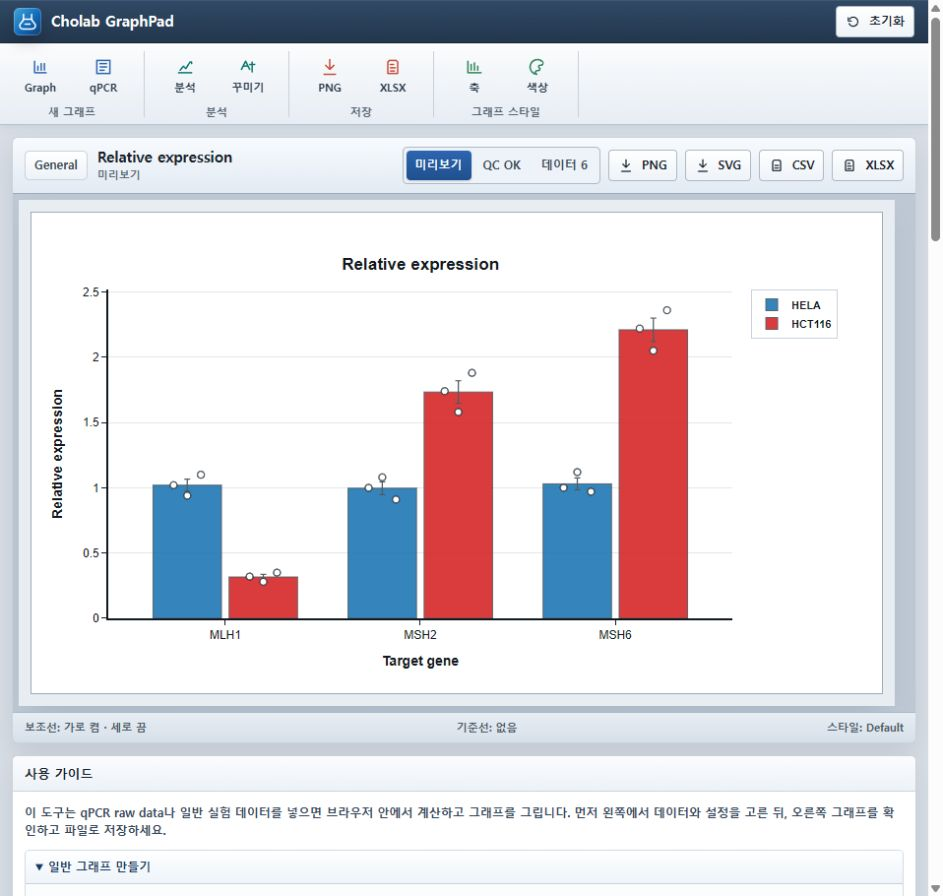

# Cholab GraphPad

<p align="center">
  
</p>

## 바로 실행

[Cholab GraphPad 열기](https://Park-Junjae.github.io/Cholab-graphpad/)

위 링크를 누르면 설치 없이 브라우저에서 바로 열립니다.

Cholab GraphPad는 일반 실험 데이터를 우선으로 자동 인식해 그래프를 추천하고, 필요할 때 qPCR raw data까지 분석할 수 있는 정적 웹앱입니다. 별도 설치 없이 GitHub Pages 링크를 브라우저로 열어 사용합니다.

## 데이터 처리

선택한 실험 파일은 브라우저 메모리에서 읽고 계산합니다. 앱 자체에는 로컬 파일을 분석 서버로 업로드하는 코드가 없습니다.

현재 공개 페이지는 SheetJS와 Plotly를 외부 CDN에서 불러오므로 처음 열 때 인터넷 연결이 필요합니다. 공개 전 검토가 필요한 제한 데이터에는 기관의 데이터 취급 정책을 우선 적용하세요.

Cholab GraphPad는 Cho Lab이 만든 독립 연구 도구이며 GraphPad Software, LLC 또는 GraphPad Prism과 제휴하거나 이들로부터 보증받은 제품이 아닙니다.

## 빠른 시작

1. [Cholab GraphPad 열기](https://Park-Junjae.github.io/Cholab-graphpad/)를 누릅니다.
2. 기본으로 열리는 `일반 그래프` 탭에서 시작합니다. qPCR 데이터가 필요할 때만 `qPCR` 탭을 선택합니다.
3. XLSX/CSV/TSV 파일을 업로드하거나 표를 붙여넣습니다.
4. 오른쪽 `미리보기`에서 그래프를 확인합니다.
5. 필요한 경우 제목, X/Y축 이름, 그룹, 오차막대, 범례 위치, 색상 팔레트, 보조선과 기준선을 조정합니다.
6. `PNG`, `SVG`, `CSV`, `XLSX`로 저장합니다.

## 일반 그래프

일반 그래프 탭은 데이터 형태를 보고 적절한 그래프를 자동 추천합니다. 추천이 마음에 들지 않으면 그래프 버튼이나 `그래프 종류 Graph` 선택 메뉴에서 바로 바꿀 수 있습니다.

지원 그래프:

- Bar + dots
- Grouped bar
- Line
- Scatter
- Box
- Violin
- Histogram
- Heatmap
- Dose response
- Volcano

자동 추천 예시:

- `Target/Gene + Sample/Condition + Value/RE`: grouped bar
- `Time/Day/Hour + Value + Group`: line
- `Dose/Concentration + Response/Viability`: dose-response
- `log2FC + p-value/padj`: volcano
- 첫 열은 gene/sample 이름, 나머지가 여러 숫자 컬럼: 자동으로 `Series / Value` 구조로 정리한 뒤 grouped bar 또는 line
- sheet 이름에 heatmap/matrix/correlation 등이 들어간 숫자 행렬: heatmap
- 숫자형 컬럼 2개 이상: scatter
- 숫자형 컬럼 1개: histogram

## qPCR 그래프

qPCR 탭은 장비에서 export한 raw table을 받아 relative expression 그래프를 만듭니다.

지원 입력:

- Raw well-level CSV/XLSX: `Well`, `Target`, `Sample`, `Ct` 또는 `Cq`
- Ct/Cq 별칭: `Mean Ct`, `Mean Cq`, `Mean Equivalent Cq`, `Mean Adjusted Equivalent Cq`와 Ct 대응 이름
- QuantStudio `Sample Results`: `Sample Name`, `Target Name`, cycle mean 컬럼
- QuantStudio CSV의 `#` metadata 줄과 trailing empty column 자동 처리

QuantStudio `Sample Results`의 `-B1`, `-B2`, `-B3` suffix는 biological replicate로 사용합니다. Technical replicate는 cycle mean에 이미 요약된 것으로 처리합니다. `Biogroup Results`는 QuantStudio가 계산한 `Rq`, `Rq Min`, `Rq Max`를 aggregate 그래프로 표시하지만, replicate가 이미 합쳐진 summary이므로 biological replicate dot이나 SD/SEM 계산에는 사용할 수 없습니다.

### qPCR 계산식과 집계 기준

#### Sample Results와 raw Ct/Cq

각 target `g`, sample `s`, biological replicate `b`에 대해 다음 순서로 계산합니다.

```text
ΔCq(g,s,b)  = Cq(target,g,s,b) - Cq(reference,s,b)

calibrator mean ΔCq(g)
             = calibrator biological replicate들의 ΔCq 산술평균

ΔΔCq(g,s,b) = ΔCq(g,s,b) - calibrator mean ΔCq(g)

RE(g,s,b)   = 2^(-ΔΔCq(g,s,b))
```

- Raw well-level 입력은 먼저 동일 biological replicate 안의 technical replicate Cq를 평균합니다.
- QuantStudio Sample Results는 technical replicate가 cycle mean에 이미 요약된 것으로 간주합니다.
- 기본 cycle 컬럼 우선순위는 `Mean Adjusted Equivalent Cq`, `Mean Equivalent Cq`, `Cq`, `Ct` 순서입니다.
- 그래프의 점은 각 biological replicate의 `RE`입니다.
- 막대는 biological replicate `RE`의 산술평균입니다.
- `SD`는 표본 표준편차(`n-1`), `SEM`은 `SD / sqrt(n)`으로 계산합니다.

#### Biogroup Results

Biogroup Results는 biological replicate가 이미 합쳐진 QuantStudio summary이므로 앱에서 ΔΔCq를 다시 계산하지 않습니다. Export에 포함된 다음 값을 그대로 사용합니다.

```text
막대값     = Rq
오차막대 하한 = Rq Min
오차막대 상한 = Rq Max
```

제공된 QuantStudio export의 95% confidence-level 설정에서는 아래 관계가 확인됩니다.

```text
Fσ     = DCq SE × F Factor

Rq     = 2^(-DDCq)
Rq Min = 2^(-(DDCq + Fσ))
Rq Max = 2^(-(DDCq - Fσ))
```

`2^-x`는 지수변환이므로 Cq 단위의 대칭적인 오차가 Rq에서는 매우 비대칭적인 범위가 됩니다. `n=3`인 경우 이 파일의 `F Factor`는 `4.303`으로, 자유도 2의 95% t 계수와 일치합니다. BioRep 수가 적고 ΔCq 편차가 크면 `Fσ`가 커져 Rq Max가 급격히 증가합니다.

제공된 데이터의 `MSH3-53 / MSH3` 예:

```text
BioRep ΔCq       = 5.916, 11.092, 5.220
SD / SEM         = 3.208 / 1.852
Fσ               = 1.852 × 4.303 = 7.969
DDCq             = 0.909
DDCq confidence  = -7.060 ~ 8.879
Rq               = 0.532
Rq Min ~ Rq Max  = 0.002 ~ 133.466
```

큰 error bar는 expression 자체가 높다는 뜻이 아니라 biological replicate 사이 ΔCq 변동이 크고 추정 정밀도가 낮다는 뜻입니다. 이 예에서는 B2 ΔCq가 다른 두 replicate보다 약 5 cycle 높습니다. Raw amplification curve, melt curve, technical replicate 편차, reference gene 안정성을 먼저 확인해야 하며 그래프 모양만을 위해 replicate를 임의 제외하면 안 됩니다.

Sample Results와 Biogroup Results의 막대가 정확히 같지 않을 수도 있습니다. Sample Results 그래프는 `BioRep별 RE의 산술평균`이고, Biogroup Rq는 `aggregate mean Cq를 변환한 값`이기 때문입니다. 지수변환에서는 일반적으로 `mean(2^-x) != 2^-mean(x)`입니다.

qPCR Figure 설정에서 Y축 최소값, 최대값, 눈금 간격, 소수점 자릿수를 직접 지정할 수 있습니다. 값을 비우면 각 항목이 자동 설정으로 돌아갑니다. 눈금 간격은 Linear 축에서 사용하며 Log 축에서는 자동 계산됩니다. Biogroup Results의 장비 신뢰구간이 지나치게 넓을 때는 오차막대를 `없음`으로 바꿔 Rq 막대만 확인할 수 있습니다.

계산은 comparative Cq 방식인 `2^-ΔΔCq`를 사용합니다. 이 방식은 target/reference assay의 증폭 효율이 충분히 유사하다는 가정이 필요합니다. 효율 차이가 큰 assay에는 efficiency-corrected 분석을 사용해야 합니다.

- Livak & Schmittgen, 2001: <https://pubmed.ncbi.nlm.nih.gov/11846609/>
- MIQE guidelines: <https://pubmed.ncbi.nlm.nih.gov/19246619/>
- Thermo Fisher QuantStudio Design and Analysis Software User Guide: <https://documents.thermofisher.com/TFS-Assets/LSG/manuals/100103660_QS_DA_GC_SW_1_0_UG.pdf>

기본 컬럼 예시:

```text
Well    Target    Sample    Cq
A1      GAPDH     Control_1  18.3
A2      ACTB      Control_1  19.1
A3      IL6       Control_1  26.4
```

사용 순서:

1. `qPCR` 탭에서 파일을 업로드하거나 표를 붙여넣습니다.
2. `Reference gene 기준 유전자`에서 GAPDH, ACTB 같은 housekeeping gene을 선택합니다.
3. `Calibrator 기준 샘플`에서 Control, WT 등 기준 샘플을 선택합니다.
4. BioRep/TechRep 구조와 `오차막대 Error bar`를 선택합니다.
5. `분석`을 누릅니다.

## 수동 조정

- `X`, `Y`, `Group`, `Label`: 컬럼을 직접 지정합니다.
- `그룹 기준`: 자주 바꾸는 Group 컬럼을 빠르게 선택합니다.
- `X/Y 바꾸기`: 숫자형 축을 서로 바꿉니다.
- `제목 Title`, `X축 이름`, `Y축 이름`: 그래프에 표시될 이름을 직접 입력합니다.
- `오차막대 Error bar`: SEM, SD, 95% CI, 없음 중에서 선택합니다.
- `X값 변환`, `Y값 변환`: log10, log2, ln, sqrt, z-score, percent 변환을 적용합니다.
- `Y축 최소값`, `Y축 최대값`: 일반 그래프와 qPCR 그래프의 표시 범위를 직접 좁히거나 넓힙니다.
- `Y축 눈금 간격`: Linear 축의 주 눈금 간격을 직접 지정합니다. 비우면 자동입니다.
- `Y축 소수점 자릿수`: Y축 눈금 라벨을 0~8자리로 고정합니다. 비우면 자동입니다.
- `범례 위치 Legend`: Right, Top, Bottom, Left, Floating, Hide 중에서 선택합니다.

## Figure 스타일

- `Default`: 논문/발표용 기본 스타일을 유지하면서 그래프 종류, 축, 범례, 색상 팔레트만 빠르게 조정합니다.
- `Advanced`: figure width/height, 폰트, 제목/축/눈금 글자 크기, 여백, 축선, 보조선, 막대 투명도와 테두리, 선 두께, 점 크기와 색, replicate dot 스타일, 오차막대 색과 두께, 기준선 스타일을 직접 조정합니다.
- 오른쪽 `미리보기`는 스크롤을 내려도 따라오며, Rows/Plotted/Groups/Graph와 QC 메시지가 미리보기 안에 같이 표시됩니다.

## 보조선과 기준선

- `축과 범례 Axes`의 `가로 보조선`: Y축 방향의 내부 보조선을 켜거나 끕니다.
- `축과 범례 Axes`의 `세로 보조선`: X축 방향의 내부 보조선을 켜거나 끕니다.
- `축과 범례 Axes`의 `기준선`: cutoff, baseline, threshold처럼 강조할 값을 가로선 또는 세로선으로 추가합니다.
- `축과 범례 Axes`의 `기준선 라벨`: 추가한 기준선 이름을 직접 입력합니다.
- `축과 범례 Axes`의 `기준선 라벨 표시`: 기준선 라벨을 한 번에 보이거나 숨깁니다.
- `축과 범례 Axes`의 `기준선 목록`에서 기준선을 선택하고 `삭제`를 누르면 해당 기준선이 제거됩니다.

## 저장 형식

- `PNG`: 이미지 파일로 저장
- `SVG`: Illustrator 등에서 편집하기 좋은 벡터 파일
- `CSV`: 그래프에 사용된 표 데이터
- `XLSX`: summary, 계산 상세, warning note가 포함된 엑셀 파일

Plotly와 SheetJS는 버전이 고정된 CDN 파일을 사용합니다. GitHub Pages 링크를 열면 별도 설치 없이 그래프와 엑셀 업로드 기능을 사용할 수 있지만 인터넷 연결은 필요합니다.

## 개발과 배포 파일 생성

유지보수 원본은 `src/`에 있습니다. `src/index.html`과 `src/qpcr-core.js`를 수정한 뒤 아래 명령으로 테스트와 GitHub Pages용 payload를 생성합니다.

```bash
npm test
npm run build
```

`npm run build`는 `src/index.html`을 gzip/Base64 payload로 만들고 `index.html`, `qpcr-core.js`, `payload/chunk-*.js`를 갱신합니다. 생성된 payload를 직접 수정하지 마세요.

## 라이선스

Cholab GraphPad는 [MIT License](LICENSE)로 공개된 오픈소스 소프트웨어입니다.

## 피드백과 연락처

오류 제보, 계산 결과 비교, 기능 제안은 [GitHub Issues](https://github.com/Park-Junjae/Cholab-graphpad/issues) 또는 [best916116@gmail.com](mailto:best916116@gmail.com)으로 보내주세요.
